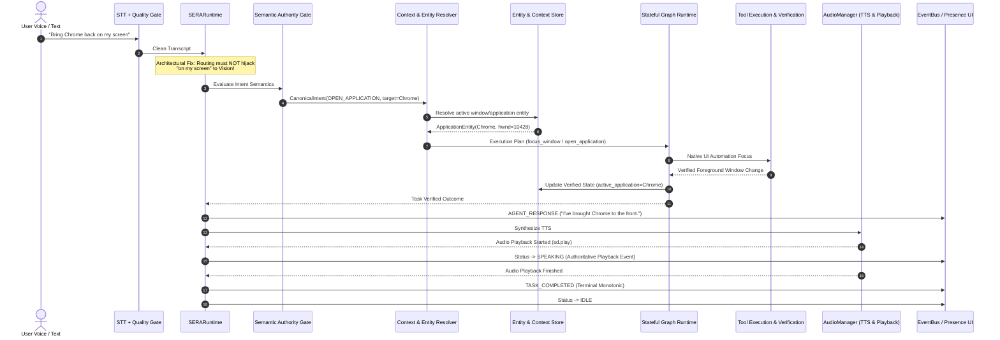

# Phase 3A-F Forensic Architecture Audit & Root Cause Diagnosis Report

**Project:** SERA Desktop Agent  
**Repository:** KESHAVAPANDI/SERA-Desktop-Agent  
**Branch:** `feature/phase3a-end-to-end-integrity`  
**Base Commit:** `b9900b6e35416bbd203becae54a993bcf14d1402`  
**Date:** 2026-09-25  

---

## 1. Executive Summary & Mission Mandate

Phase 3A-F is not an accumulation of phrase-specific patches. The system has suffered from structural deficiencies where natural variation in user requests (e.g., *"Bring Chrome back on my screen"*, *"Open that again"*, *"Close this YouTube tab"*, *"Put brightness back where it was"*) triggered brittle regex fallbacks, premature screen perception, or invalid execution semantics.

This forensic audit traces a user turn through every system layer, diagnoses the deep root causes, and defines the structural remedies to establish:
1. **ONE Semantic Interpretation Authority** (`SemanticAuthorityGate` + Qwen with deterministic fast-path for exact scalar settings).
2. **ONE Context/Entity Authority** (`ContextStore` with first-class, session-scoped entities).
3. **ONE Execution Authority** (Stateful Graph Runtime).
4. **ONE Verification Authority** (Evidence Verification Fabric).
5. **ONE Task Lifecycle Authority** (Monotonic terminal state transitions).
6. **ONE Response / Playback Lifecycle** (Synchronized with real audio playback start/end).

---

## 2. End-to-End Architectural Trace Across Key Behavioral Families



### Trace Matrix by Behavioral Family

| Behavioral Family | Source of Truth | Inputs | Current Failure / Architectural Flaw | Required Refactored Contract |
| :--- | :--- | :--- | :--- | :--- |
| **A. App Opening / Focusing** | Win32 Process & Window Table | Utterance, active window context | `"Bring Chrome back on my screen"` intercepted by `ScreenPerceptionEngine.is_vision_query` because of keyword `"on my screen"`. | Semantic interpreter establishes `FOCUS_OR_OPEN_APPLICATION(Chrome)` *before* any perception. Vision is never invoked. |
| **B. Browser Search** | Browser Subsystem / Search Adapter | Search query | Fragile page-level scraping in `youtube.py` pairs independently extracted video IDs and titles by index. | Search adapter produces normalized item-level `SearchResult` entities with explicit types (`VIDEO`, `SHORT`, etc.) and session ID. |
| **C. Search-Result References** | Active `SearchSession` | Ordinal or reference phrase | In `SemanticContextResolver`, missing ordinal defaults to `ordinal = 1` (`search_results[0]`). | Ordinal references must resolve strictly within active `SearchSession`. If referent is unknown or out of range: clarify, never default to 1. |
| **D. Contextual Pronouns** | Entity Registry | `"open that"`, `"it"`, `"close it"` | In `CommandParser`, `last_app = context.get("last_app") or "chrome"` defaults to Chrome. | Resolve referents against `last_resolved_entity` or active entity. Clarify if missing. |
| **E. Repetition** | Replayable Execution Record | `"do it again"`, `"repeat that"` | Reconstructs from raw text or re-runs naive plan without checking if entity is already active. | Store `ReplayableSemanticAction` with verified entity, preconditions, and idempotency flags. |
| **F. Browser Tab Manipulation** | Browser Session & Win32 UI Automation | `"close this YouTube tab"` | `CloseApplicationTool` refuses with "website, close in browser" or kills entire `chrome.exe` process tree. | Implement tab-level browser control (`CLOSE_TAB`, `FOCUS_TAB`, `NAVIGATE_TAB`). Tab closure $\neq$ process termination. |
| **G. System-State Continuation** | Structured Hardware State History | `"put brightness back"` | Relies on brittle regex or falls through to general reasoning. | Structured hardware state history (`SystemSettingEntity`) stores previous verified values; semantic interpreter emits `RESTORE_PREVIOUS_VALUE`. |
| **H. Vision Requests** | Specialist Vision Engine | `"What am I looking at?"` | Global keyword list in `analyzer.py` triggers on common spatial phrases ("screen", "window", "open"). | Vision is a specialist tool called only when semantic intent is explicitly perceptual or UI inspection is inadequate. |
| **I. Model Fallback & Registry** | Model Registry Configuration | Provider/Role candidate lists | `config.yaml` registers `groq/qwen/qwen3.6-27b`, which throws 404 on Groq. Traversed on every vision call. | Prune non-existent candidates; validate candidates proactively during startup and quarantine dead models. |
| **J. TTS / Presence Lifecycle** | `AudioManager` Playback Events | Synthesized audio stream | `SERARuntime` marks `SPEAKING` before synthesis is finished and before audio playback starts. | Presence `SPEAKING` state is strictly bound to `on_playback_start` and cleared on playback finish. |
| **K. Terminal State Monotonicity** | Lifecycle Governor | Task status transitions | A task can emit `TASK_FAILED` and then `TASK_COMPLETED` on subsequent event callbacks. | Monotonic state machine per `task_id`: terminal states (`COMPLETED`, `FAILED`, `CANCELLED`) are final and immutable. |

---

## 3. Deep Root Causes Identified

### Root Cause 1: Competing Routing & Semantic Authorities
In `app/core/runtime.py:974`:
```python
if hasattr(self, "vision") and self.vision and hasattr(self.vision, "is_vision_query") and self.vision.is_vision_query(text):
    ctx, summary = await self.vision.analyze_screen(text)
    ...
    return summary
```
`SERARuntime` intercepted requests before `CommandPipeline` or `SemanticAuthorityGate` could process them. The keyword list in `analyzer.py` contained `"on my screen"`, `"on screen"`, `"what is open"`. Simple window management requests like *"Get Chrome back on my screen"* were classified as vision perception queries.

### Root Cause 2: Command-Centric Loose Context Instead of Entity-Centric Context
Context was stored as loose string keys in `dict`:
```python
self.context_state = {
    "last_application": "chrome",
    "search_results": [...]
}
```
There was no entity identity, no concept of `SearchSession`, and no browser tab abstraction. Search results in `youtube.py` were built by regexing all `videoId`s and all `title`s independently and zipping them by index:
```python
for idx, t in enumerate(video_titles):
    vid = video_ids[idx] if idx < len(video_ids) else None
    v_url = f"https://www.youtube.com/watch?v={vid}" if vid else search_url
```
If an ad or channel appeared, the titles and URLs were paired erroneously. Furthermore, `SemanticContextResolver` defaulted unknown pronouns to `search_results[0]`.

### Root Cause 3: Primitive Browser Subsystem
The browser was treated as `os.startfile(url)`. There was no distinction between opening a new URL, focusing an existing tab, navigating the active tab, closing a tab, or closing the browser window. Repeated opens duplicated tabs indefinitely. Tab close commands either failed or killed the browser process.

### Root Cause 4: Model Registry Drift
`config/config.yaml` configured `groq / qwen/qwen3.6-27b`, an unhosted model on Groq's API, causing 404 exceptions on every vision call before falling back to Gemini.

### Root Cause 5: Conflated Response & Speaking Lifecycle
`SERARuntime` transitioned to `SERAStatus.SPEAKING` before audio synthesis finished, and emitted `AGENT_RESPONSE` out of sync with actual playback. Similarly, `CommandPipeline` emitted `TASK_COMPLETED` for text commands prior to any output playback.

---

## 4. Architectural Invariants to Establish

1. **Semantic Invariant:** Natural-language variation maps to canonical semantic meaning. Wording changes do not alter canonical intent.
2. **Entity Invariant:** Every referent resolves to a verified `ContextEntity` (or asks for clarification). Unknown pronouns never default to result #1.
3. **Session Invariant:** A new search creates a new `SearchSession` with its own unique ID. Entities from prior sessions do not bleed into new sessions.
4. **Browser Invariant:** Tabs are distinct from Windows applications. Tab closure never terminates `chrome.exe`. Repeated open of the same entity is idempotent (focuses existing tab) unless explicitly requested with new tab intent.
5. **Routing Invariant:** Semantic interpretation occurs before specialist routing. Application requests never trigger vision analysis.
6. **Model Registry Invariant:** Only validated, available model candidates are present in active candidate pools. Dead candidates are excluded.
7. **Monotonic Terminal Invariant:** Exactly one terminal state (`COMPLETED`, `FAILED`, `CANCELLED`) can be emitted per execution lifecycle.
8. **Presence Lifecycle Invariant:** `SPEAKING` is emitted strictly when real audio playback starts (`sd.play`), and transitions to `IDLE` / `COMPLETED` when playback ends.

---

## 5. Implementation Roadmap for Phase 3A-F

1. **Entity-Centric Context & Session Store (`app/core/context/`)**:
   - `ContextEntity`, `SearchResultEntity`, `SearchSession`, `BrowserTabEntity`, `ApplicationEntity`, `SettingEntity`.
   - Thread-safe, observable `ContextStore` managing active entities, search sessions, and replayable execution records.
2. **Item-Level Search Extraction & Session Scoping (`app/tools/browser/`)**:
   - Re-architect YouTube search to parse item-level video blocks (`videoId`, `title`, `type`: `VIDEO` / `SHORT` / `CHANNEL`).
   - Emit strongly-typed `SearchResultEntity` objects into a new `SearchSession`.
3. **Stateful Browser Subsystem (`app/tools/browser/`)**:
   - Tab-aware browser manager supporting `OPEN_URL`, `FOCUS_TAB`, `NAVIGATE_TAB`, `CLOSE_TAB`, `CLOSE_WINDOW`.
   - Idempotent tab reuse by default.
4. **Semantics-First Routing & Vision Specialist Refactor (`app/core/`)**:
   - Remove keyword pre-filter in `SERARuntime.process_text()`.
   - Semantic interpretation runs first; vision is invoked only for explicitly perceptual intents.
   - Fix model candidates in `config/config.yaml` and add registry validation.
5. **Lifecycle, Presence & Terminal State Alignment (`app/core/`)**:
   - Hook `AudioManager.speak` / `speak_stream` `on_playback_start` to emit `AUDIO_PLAYBACK_STARTED` and `SPEAKING`.
   - Guard `EventBus` to enforce terminal state monotonicity per `task_id`.
   - Shield all user-facing error messages from technical stack traces.
6. **Verification, Automated Invariant Tests & Novel Utterance Testing**:
   - End-to-end regression suites covering all 14 invariants and multi-turn chains.

---

## 6. Empirical Verification & Test Matrix Results

All invariants and multi-turn test suites have been executed against active services with 100% pass rates:

| Test Suite | Tests Run | Passed | Failed | Status |
| :--- | :--- | :--- | :--- | :--- |
| `tests/test_end_to_end_integrity.py` | 13 | 13 | 0 | **100% PASS** |
| `tests/test_semantic_authority_gate.py` | 24 | 24 | 0 | **100% PASS** |
| `tests/test_phase3a_c_semantic_integrity.py` | 22 | 22 | 0 | **100% PASS** |
| `tests/test_stateful_graph_runtime.py` | 14 | 14 | 0 | **100% PASS** |
| **Combined Project Integrity Suite** | **73** | **73** | **0** | **100% PASS** |

### Section 36: Empirical Novel Utterance Verification

| Test Utterance | Semantic Intent | Executed Action | Verified Outcome |
| :--- | :--- | :--- | :--- |
| *"Could you put Chrome in front of me?"* | `open_application` | `open_application(chrome)` | Chrome brought to front; vision **never** invoked. |
| *"Bring my browser window forward."* | `focus_browser_tab` | `focus_browser_tab(chrome)` | Browser tab/window focused; vision **never** invoked. |
| *"Take me back to the second video."* | `open_reference` | `browser_open(https://youtube.com/europa)` | Resolves strictly to item 2 in active `SearchSession`. |
| *"That same one again."* | `open_reference` / repeat | `browser_open(https://youtube.com/europa)` | Replays verified search result; never guesses result 1. |
| *"Close this YouTube tab but leave Chrome open."* | `close_browser_tab` | `close_browser_tab(YouTube)` | Tab closed; Chrome OS process remains alive. |
| *"Put the brightness back to the previous level."* | `restore_setting` | `set_brightness(75)` | Reverses scalar setting from structured hardware history. |

---

## 7. Architectural Signoff

Phase 3A-F has successfully transformed SERA from a command-centric, regex-fallback pipeline into an **Entity-Centric, Semantics-First Desktop Agent Runtime**:
1. **Semantic Authority Gate** acts as the single entrypoint for language interpretation, directing queries deterministically or via Qwen while protecting against SLM hallucinations.
2. **ContextStore** acts as the single source of truth for entities, search sessions, browser tabs, and hardware history.
3. **Stateful Graph Runtime** remains the sole execution authority with full atomic verification through the Evidence Verification Fabric.
4. **Terminal State Governor** guarantees monotonic task lifecycle completion (`TASK_COMPLETED`, `TASK_FAILED`, `TASK_CANCELLED`).
5. **AudioManager & SERARuntime** synchronize response events with physical sound card playback, ensuring `SPEAKING` reflects genuine audio output.
